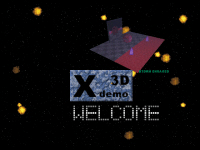



## XDemo3D

### Description

Accessing DirectDraw, Direct3DRM and DirectSound * 16-bit color * backbuffering * transparent blitting * direct memory access to surface memory * D3D driver detection * RGB color model * D3DRM mesh object manipulation * textured meshes * texture transparency * decals * animated textures * MIRROR effect * dynamic lighting * dynamic sound * background music * 20fps on Pentium266 * fully documented * freeware
 
### More Info
 
WARNING: This demo dates back to 1998. It uses a type library written by Patrice Scribe to access DirectX, not the official Microsoft support for DirectX in VB. Never the less, you should be able to adapt the basics easily.

             |
---                |---
**Submitted On**   |1998-10-08 16:31:42
**By**             |[Wolfgang Kienreich](https://github.com/Planet-Source-Code/PSCIndex/blob/master/ByAuthor/wolfgang-kienreich.md)
**Level**          |Advanced
**User Rating**    |4.6 (41 globes from 9 users)
**Compatibility**  |VB 6\.0
**Category**       |[DirectX](https://github.com/Planet-Source-Code/PSCIndex/blob/master/ByCategory/directx__1-44.md)
**World**          |[Visual Basic](https://github.com/Planet-Source-Code/PSCIndex/blob/master/ByWorld/visual-basic.md)
**Archive File**   |[CODE\_UPLOAD9637952000\.zip](https://github.com/Planet-Source-Code/wolfgang-kienreich-xdemo3d__1-11270/archive/master.zip)

